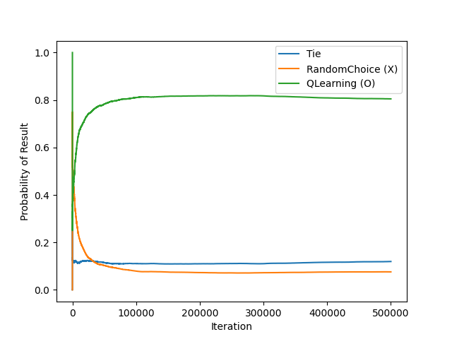

# tictactoe

Simple tictactoe harness for testing AI approaches.

Different approaches are put together in "battles" and the result rate over time
is graphed.

## RandomChoice

> Of the available empty spaces, randomly select one

The data stabilizes quickly here. The first player (X) wins ~60% of the time,
as expected. The second agent (O) wins ~30% of the time. The remaining ~10% of
games end in a tie.

## Q Learning

> Explore and learn rewards for different series of moves, hopefully learning
> better moves

Despite being at the disadvantage of going second, the QLearning agent manages
to eventually take over, winning slightly more often.

When given the first turn advantage, QLearning runs away and ends up winning
~80% of the time and maintaining the same tying rat; only losing ~10% of the
time. There is further room to tune the learning rate and discount factor.

